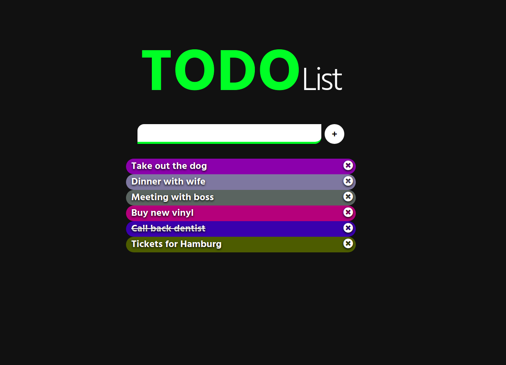

# To Do List

- Link of the project: https://kevschmidt.github.io/toDoList/
- Clone the repository: ``` git clone git@github.com:kevSchmidt/toDoList.git ```

### Tools:
<h1>


</h1>

### Preview:


### DCI exercise
Create a ToDo list with html, javascript, sass and make it responsive.

### Features:
- Color Generator function using javascript.
- All items have a different & random color.
- On click items are marks as done.

